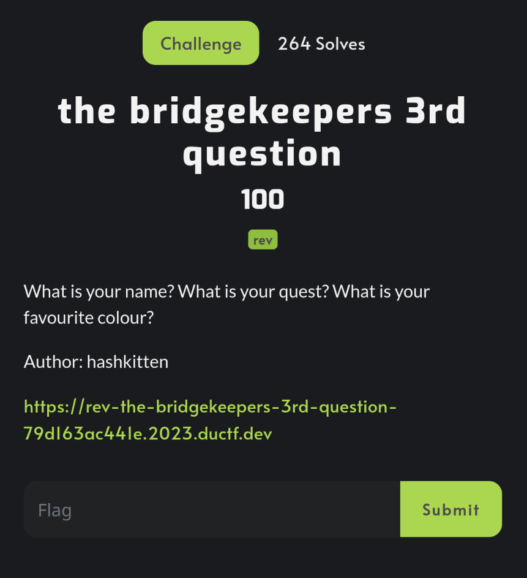
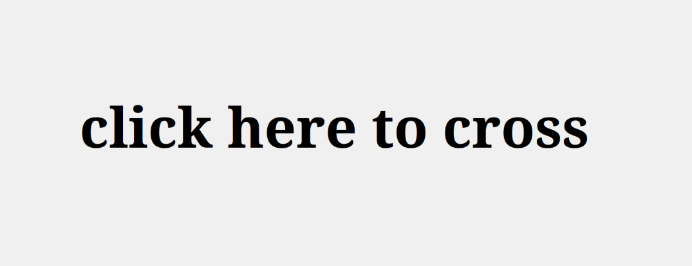
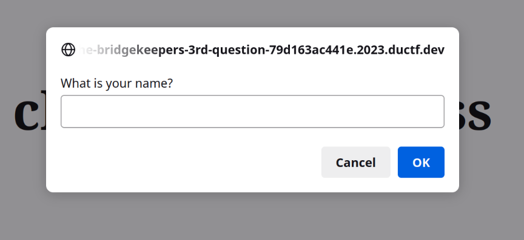
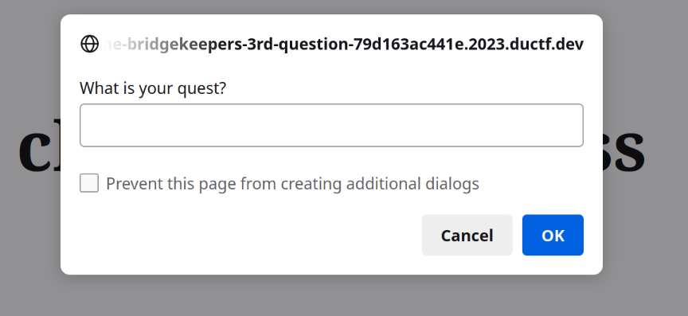
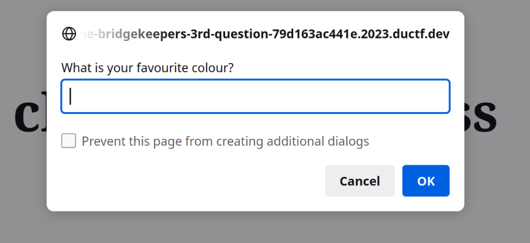
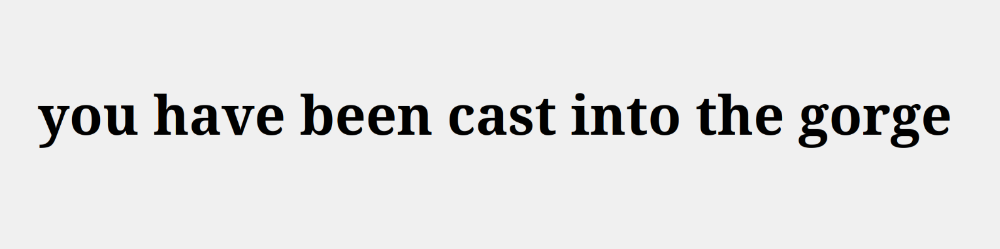
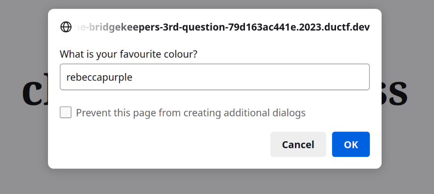
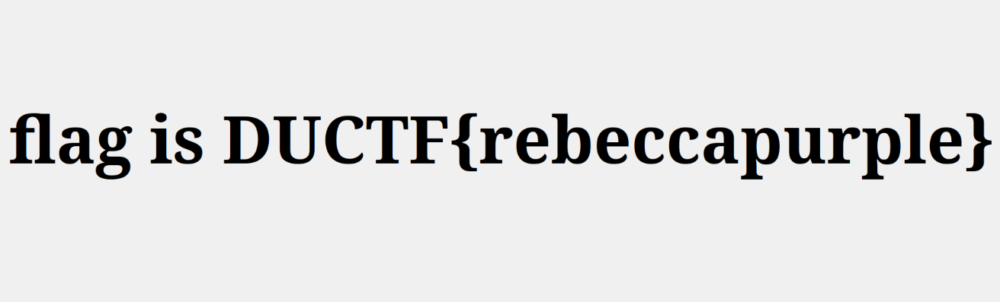

# DownUnderCTF

### The Bridgekeepers 3rd Question		



### Additional Resources

- [UTF-8](https://asecuritysite.com/coding/asc2)

### Steps
---
#### Web page

After accessing the link in the challenge description we see this page:



When we click on the message we are asked to enter information into three forms:







After filling the forms the final page has the following message:



#### Page Source

After playing with the forms we can see that it takes us to that final message
```
<!DOCTYPE html>
<html>
<head>
  <title>The Bridgekeeper's Third Question</title>
  <!-- https://www.youtube.com/watch?v=0D7hFHfLEyk -->
  <style>
    body {
      background-color: #f0f0f0;
      display: flex;
      align-items: center;
      justify-content: center;
      height: 100vh;
      margin: 0;
      padding: 0;
    }
    
    .word {
      font-size: 48px;
      font-weight: bold;
      cursor: pointer;
    }
  </style>
  <script id="challenge" src="text/javascript">
    function cross() {
      prompt("What is your name?");
      prompt("What is your quest?");
      answer = prompt("What is your favourite colour?");
      if (answer == "blue") {
        document.getElementById('word').innerText = "flag is DUCTF{" + answer + "}";
        cross = escape;
      }
      else {
        document.getElementById('word').innerText = "you have been cast into the gorge";
        cross = unescape;
      }
    }
  </script>
</head>
<body>
  <div id="word" class="word" onclick="cross()">click here to cross</div>
</body>
</html>
```

In the fourth line we can see a [URL to a youtube video](https://www.youtube.com/watch?v=0D7hFHfLEyk) as an html comment. The video is a clip from *Monty Python and the Holy Grail*, a movie from 1975 and is a reference to the challenge we have here. Its about and old man known as *The Keeper of the Bridge of Death*, he asks three questions and if the three of them are correct one can pass through the bridge, if not, they are cast into the *Gorge of Eternal Peril*, which is what we saw earlier! However after reviewing the source code we can see the three questions in the *cross* function:

```
prompt("What is your name?");
prompt("What is your quest?");
answer = prompt("What is your favourite colour?");
```
Only the third answer is stored and considered. Additionally, we can see that there is a file we can access through our browser in the script element:
```
<script id="challenge" src="text/javascript">
```

#### Script File

```
prompt = function (fun, x) {
  let answer = fun(x);
  
  if (!/^[a-z]{13}$/.exec(answer)) return "";

  let a = [], b = [], c = [], d = [], e = [], f = [], g = [], h = [], i = [], j = [], k = [], l = [], m = [];
  let n = "blue";
  a.push(a, a, a, a, a, a, a, a, a, a, a, a, a, a, a, a, a, b, a, a, a, a, a, a, a, a);
  b.push(b, b, b, b, c, b, a, a, b, b, a, b, a, b, a, a, b, a, b, a, a, b, a, b, a, b);
  c.push(a, d, b, c, a, a, a, c, b, b, b, a, b, c, a, b, b, a, c, c, b, a, b, a, c, c);
  d.push(c, d, c, c, e, d, d, c, c, c, c, b, c, c, d, c, b, d, a, d, c, c, c, a, d, c);
  e.push(a, e, f, c, d, e, a, e, c, d, c, c, c, d, a, e, b, b, a, d, c, e, b, b, a, a);
  f.push(f, d, g, e, d, e, d, c, b, f, f, f, a, f, e, f, f, d, a, b, b, b, f, f, a, f);
  g.push(h, a, c, c, g, c, b, a, g, e, e, c, g, e, g, g, b, d, b, b, c, c, d, e, b, f);
  h.push(c, d, a, e, c, b, f, c, a, e, a, b, a, g, e, i, g, e, g, h, d, b, a, e, c, b);
  i.push(h, a, d, b, d, c, d, b, f, a, b, b, i, d, g, a, a, a, h, i, j, c, e, f, d, d);
  j.push(b, f, c, f, i, c, b, b, c, j, i, e, e, j, g, j, c, k, c, i, h, g, g, g, a, d);
  k.push(i, k, c, h, h, j, c, e, a, f, f, h, e, g, c, l, c, a, e, f, d, c, f, f, a, h);
  l.push(j, k, j, a, a, i, i, c, d, c, a, m, a, g, f, j, j, k, d, g, l, f, i, b, f, l);
  m.push(c, c, e, g, n, a, g, k, m, a, h, h, l, d, d, g, b, h, d, h, e, l, k, h, k, f);

  walk = a;

  for (let c of answer) {
    walk = walk[c.charCodeAt() - 97];
  }

  if (walk != "blue") return "";

  return {toString: () => _ = window._ ? answer : "blue"};

}.bind(null, prompt);

eval(document.getElementById('challenge').innerText);
```

Now we can thoroughly see the *prompt* function. In the fifth line we see an *if* statement that matches the input or answer we give with this regular expression: `/^[a-z]{13}$/` , which checks if *answer* only consists of 13 lowercase characters, and if that is not met the function cannot continue. 

We can see that variables from the alphabet a-n are initialized, however, only a-m are initialized as empty arrays, and that variable *n* is assigned an initial value of the string *blue*. So that would be a total of 13 arrays and one string value.

What follows is value are being pushed into every array, however, these values are the empty arrays themselves, a total of 26 values are pushed into every single one of the 13 arrays.

Then we have the `walk = a;` line and what follows is this for loop:
```
for (let c of answer) {
	walk = walk[c.charCodeAt() - 97];
}
```

## Solution

After analyzing the *JavaScript* function, I was able to come to the conclusion that the for loop iterates over each character of what we input as the answer, then it obtains the decimal value of its UTF-16 encoding value and it subtracts 97 from it. Finally, it reassigns it own value to `walk[<UTF-16_int_value - 97]` which if we consider the first iteration, since *walk* is initially assigned the value of a (an array) `walk = a;` , its value essentially changes to `a[n]` where `n` is equal to the decimal UTF-16 value of the first character of our answer minus 97. If we pay close attention to the values of each array, we can see that there is one specific index which could lead us to the next array, hence the term walking. For example when considering array a:

```  
a
[a, a, a, a, a, a, a, a, a, a, a, a, a, a, a, a, a, b, a, a, a, a, a, a, a, a]
a[17];
b
```

So this means we would have to *walk* through the arrays to eventually get to the only value that is not an array wich is `n="blue"` and `n` is only accessible in array `m`. 

My approach was to visually count which index of interest for each array. These values were obtained:

```
a:17, b:4, c:1, d:4, e:2, f:2, g:0, h:15, i:20, j:17, k:15, l:11, m:4
```

That should lead us to `n`. And should pass this condition:

```
if (answer == "blue") {
	document.getElementById('word').innerText = "flag is DUCTF{" + answer 	+ "}";
	cross = escape;
}
else {
	document.getElementById('word').innerText = "you have been cast into the gorge";
	cross = unescape;
}
```

For calculating which 13 UTF-16 characters would be needed that would let us walk to the answer this simple python script was used based on the indices's of interest obtained:
```
indices = [17, 4, 1, 4, 2, 2, 0, 15, 20, 17, 15, 11, 4]
characters = []

for num in indices:
    char_code = num + 97
    character = chr(char_code)
    characters.append(character)

result = ''.join(characters)
print(result)
```
When we run the script we obtain the sting `rebeccapurple`. Now we can try it on the the third form (which is the only one that matters):





And there is our flag!

***DUCTF{rebeccapurple}***
