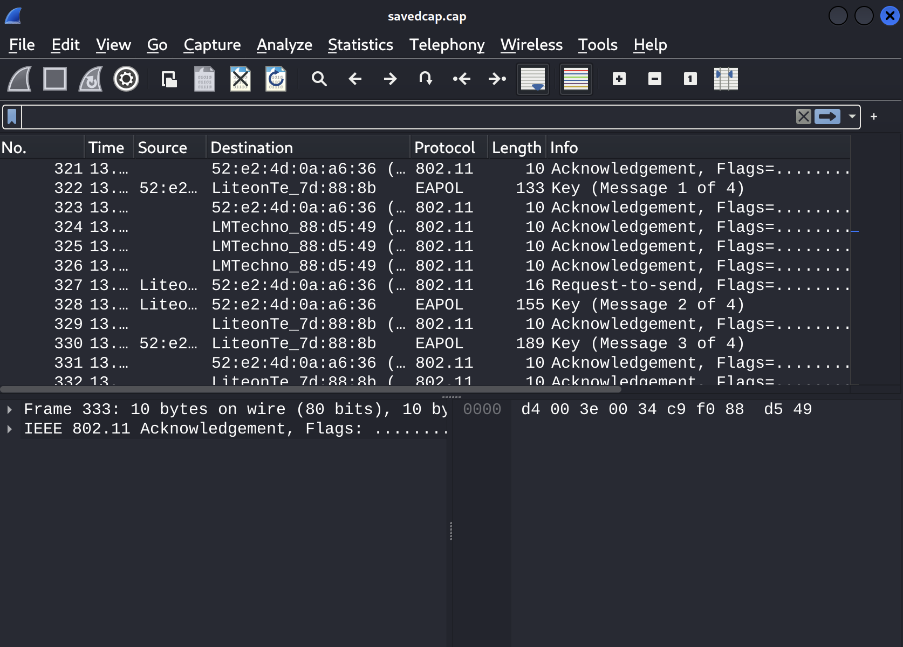

# WPA

### Additional Resources

- [Wireshark](https://www.wireshark.org/)
- [WPA 4-Way Handshake](https://www.wifi-professionals.com/2019/01/4-way-handshake)
- [HashCat - WPA](https://hashcat.net/wiki/doku.php?id=cracking_wpawpa2)

### Steps

---

#### Pcap File

The challenge provides us with a packet capture file (pcap) to analyze. I used wireshark but Tshark is also an option.

#### Pcap Analysis

The packets look to be from  a WPA 4-way handshake, it is also suggested by the challenge name.



#### Cracking

Luckily there is a hashcat mode for cracking WPA handshakes. Mode 22000 will let us crack this handshake, additionally, I used the *rockyou* word list.

```
hashcat -m 22000 hash.hc22000 /usr/share/wordlists/rockyou.txt
```
After a while, the handshake was cracked, thus revrealing our flag:

```
hashcat -m 22000 hash.hc22000 /usr/share/wordlists/rockyou.txt --show
2ff573c8a566b0607def8f51b064f665:52e24d0aa636:e00af67d888b:Pctf wifi challenge:qazwsxedc
```
And there is the flag!

***qazwsxedc***