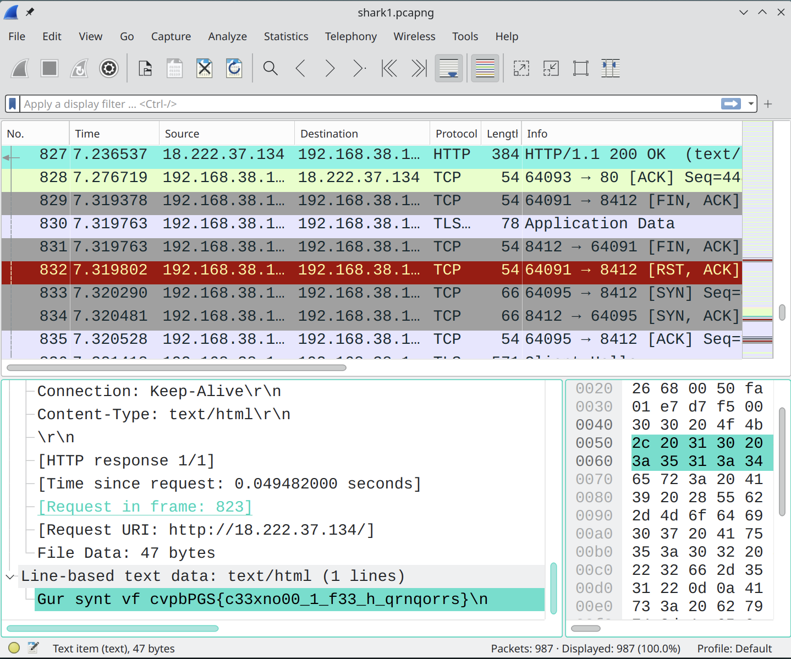

# Wireshark doo doo do doo

### Links

- Challenge in [picoCTF](https://play.picoctf.org/practice/challenge/115)

### Additional Resources

- [Wireshark](https://www.wireshark.org/)
- [Rot13](https://rot13.com/)

### Steps

---

#### Challenge Description & Hints

The challenge provides us with a packet capture file (pcap) to analyze. I used wireshark but Tshark is also an option.

#### Pcap Analysis

To quickly find the low hanging fruit I did the following: *file > export objects > HTTP*, and skimmed the *Content Type* section. I found a *text/html* and its looked very interesting. It has the flag structure but it is likely encoded.



#### Decoding

This string can be decoded quickly in wireshark. Right clicking the string and choosing the *Show Packet Bytes...* option brings a new tab with our selected string and a decoding option menu. It looked like it was rot13 encoded and there is an option to decode that. And that gives us this ascii text which contains the flag.
```
The flag is picoCTF{p33kab00_1_s33_u_deadbeef}
```

***picoCTF{p33kab00_1_s33_u_deadbeef}***