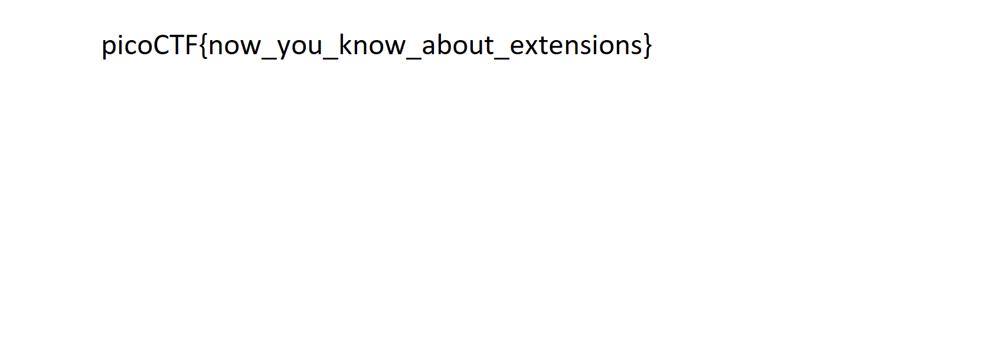

# extensions

### Links

- Challenge in [picoCTF](https://play.picoctf.org/practice/challenge/52)

### Steps

---
#### Challenge Description & Hints

This is a really weird text file [TXT](https://jupiter.challenges.picoctf.org/static/e7e5d188621ee705ceeb0452525412ef/flag.txt)? Can you find the flag?

#### Files

We are given a file called *flag.txt*. However, after using the *file* utility for analysis we can easily find out that it isn't a text file but a png file:

```
file flag.txt
flag.txt: PNG image data, 1697 x 608, 8-bit/color RGB, non-interlaced
```

#### Image Analysis

I opened the file using an image viewer and could indeed find the flag:



***picoCTF{now_you_know_about_extensions}***
